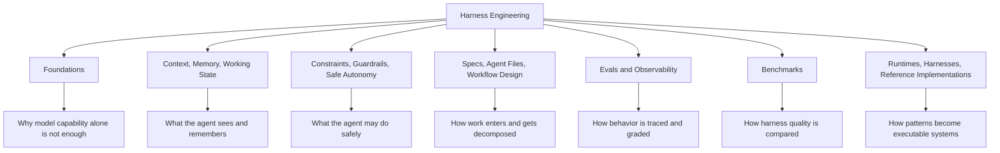
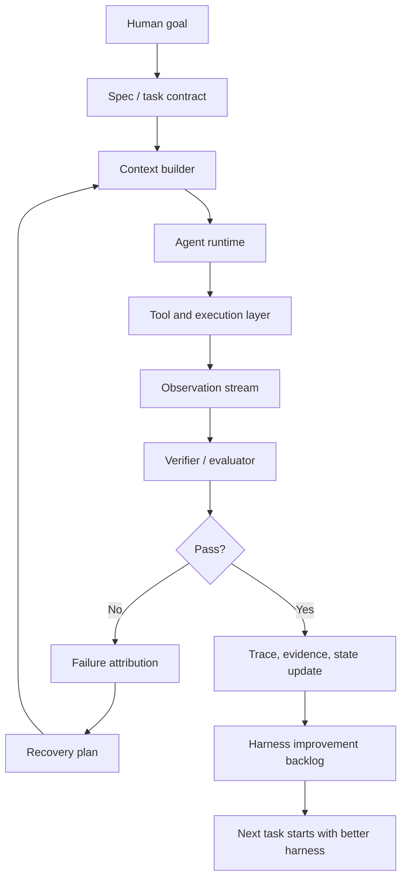
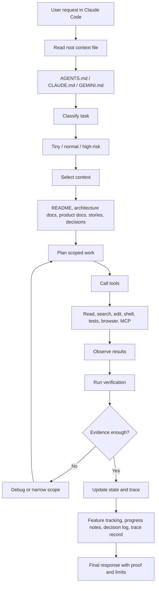
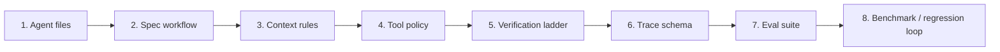
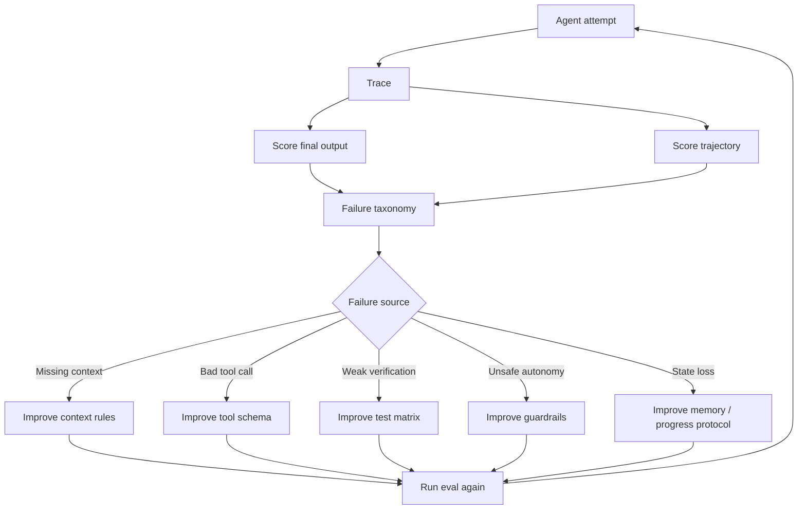
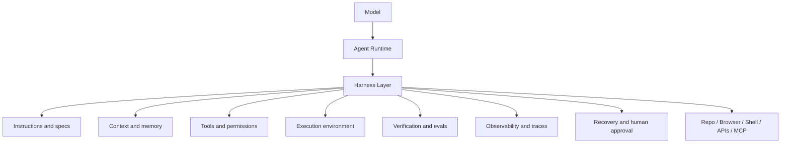

# Awesome Harness Engineering Flow

Research target: https://github.com/walkinglabs/awesome-harness-engineering

Snapshot date: 2026-05-31

Purpose: extract a general harness-engineering flow from the curated resource map, then adapt it into a Claude Code repo harness template.

## What This Source Adds

`awesome-harness-engineering` is a curated map of articles, playbooks, benchmarks, specs, runtimes, and reference implementations for harness engineering.

Unlike `harness-experimental`, it is not a concrete installable harness. It is a field map. It shows which layers matter when making agents reliable in real workflows.

## Harness Engineering Scope

The README frames harness engineering as the practice of shaping the environment around AI agents so they can work reliably.

Core intersection areas:

- Context engineering.
- Evaluation.
- Observability.
- Orchestration.
- Safe autonomy.
- Software architecture.

Generic agent tooling is out of scope unless it directly covers harness design, context management, evaluation, runtime control, or reliability-critical primitives.

## Field Map From The Repo



## General Harness Flow



This is the reusable pattern across the resources: goal becomes contract, contract selects context, agent acts through constrained tools, execution produces observations, verifier decides completion, trace improves next run.

## Claude Code Harness Flow



## Harness Build Sequence For A Repo



Build order:

1. Agent files: create `AGENTS.md`, `CLAUDE.md`, or `GEMINI.md` as stable entrypoints.
2. Spec workflow: define how vague work becomes story-sized work.
3. Context rules: define what to read by task type and risk level.
4. Tool policy: define safe actions, approval gates, and high-risk operations.
5. Verification ladder: define quick, integration, E2E, platform, and release checks.
6. Trace schema: record actions, files read, files changed, errors, proof, friction.
7. Eval suite: convert traces into repeatable evaluation tasks.
8. Benchmark loop: compare harness changes against baseline runs.

## Reliability Loop



Important distinction:

- Final-output eval asks whether the task ended correctly.
- Trace eval asks whether the path was safe, efficient, observable, and recoverable.

Harness quality needs both.

## Layer Model For Seminar



In seminar terms: the model is not the harness. The harness is the system that decides what the model sees, what it can do, how it proves work, and how failures become better future behavior.

## Practical Claude Code Template

```text
project/
  AGENTS.md or CLAUDE.md or GEMINI.md
    - project map
    - setup commands
    - verification commands
    - feature tracking
    - definition of done

  docs/
    product/
      - source of product truth
    stories/
      - scoped work packets
    decisions/
      - architecture and product decisions
    harness/
      - context rules
      - risk lanes
      - trace protocol
      - eval protocol

  tests/
    - unit, integration, e2e, smoke

  scripts/
    - check commands
    - harness utility commands
```

Feature tracking stays inside the root context file for this seminar model. No separate feature-list file.

## What To Add To The Seminar Deck

Use `awesome-harness-engineering` to justify a broader flow than repo files alone:

- Harness is a field, not just a prompt pattern.
- Reliable agents need context, guardrails, runtime, evals, observability, and benchmarks.
- Claude Code can act as the interactive runtime, but the repo must supply the operating surface.
- The next maturity step after a basic template is trace-driven evals.

Suggested slide flow:

1. Harness field map: context, safety, specs, evals, runtimes.
2. Claude Code harness loop: request, context, tools, verification, trace.
3. Reliability loop: trace, score, attribute failure, improve harness, rerun.

## Evidence Notes

Sourced facts from the repo:

- The repo describes harness engineering as shaping the environment around AI agents so they can work reliably.
- It explicitly scopes harness engineering across context engineering, evaluation, observability, orchestration, safe autonomy, and software architecture.
- It groups resources into foundations, context/memory/state, guardrails, specs/workflow, evals/observability, benchmarks, and runtimes/reference implementations.
- It treats benchmarks as useful for comparing harness quality, not just model quality.

Inference for our seminar:

- A Claude Code harness template should not stop at `AGENTS.md`. It should include context routing, risk classification, proof expectations, trace capture, and eval loops.
- The flow should emphasize improving the harness after failures, not only retrying the agent with a longer prompt.
