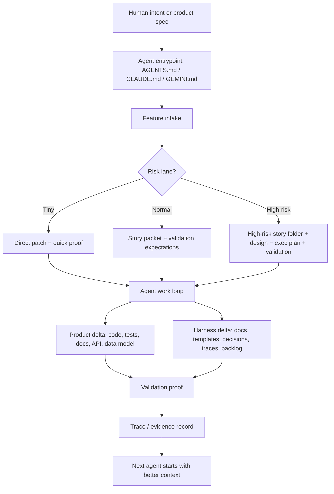
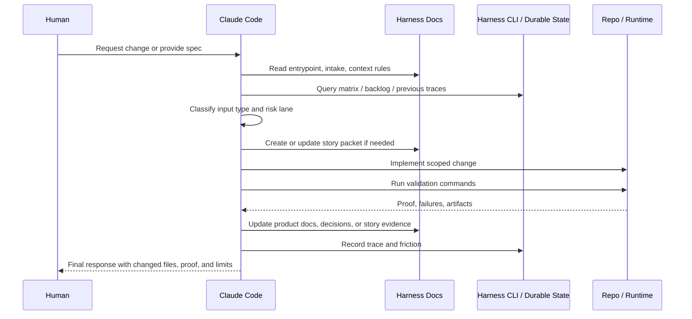
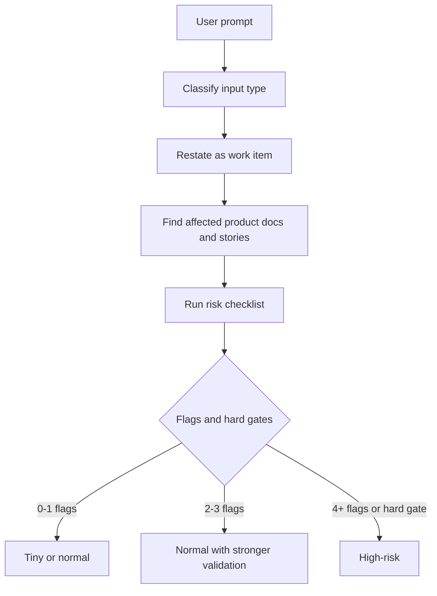
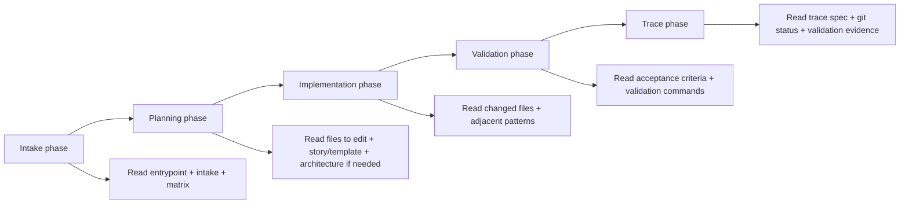

# Claude Code Harness Template Flow

Research target: https://github.com/hoangnb24/harness-experimental

Purpose: turn a normal repository into an agent-ready workspace for Claude Code and other coding agents. The app is what users touch. The harness is what agents touch.

## Core Idea

A Claude Code harness should answer these questions before the agent edits code:

- What should I read first?
- What type of work is this?
- Which product contract does it affect?
- How risky is the change?
- What proof will show the work is done?
- What decision, trace, or lesson should future agents inherit?

The template is not an app scaffold. It is an operating layer around any app repo.

## Minimal Template Surface

```text
project/
  AGENTS.md                # stable agent entrypoint and local rules
  CLAUDE.md or GEMINI.md   # optional context file for the active agent surface
  README.md                # human-facing project overview
  docs/
    HARNESS.md             # human-agent collaboration model
    FEATURE_INTAKE.md      # classify work and choose risk lane
    CONTEXT_RULES.md       # what to read by phase and lane
    ARCHITECTURE.md        # boundary rules and stack decisions
    TEST_MATRIX.md         # behavior-to-proof matrix
    TRACE_SPEC.md          # execution trace requirements
    product/               # current product contract
    stories/               # story packets and backlog
    decisions/             # durable architecture/product decisions
    templates/             # story, decision, validation templates
  scripts/
    bin/harness-cli        # optional durable layer CLI
    schema/                # SQLite migrations if CLI is used
```

For this seminar deck, keep feature tracking inside `AGENTS.md`, `CLAUDE.md`, or `GEMINI.md`. Do not introduce a separate feature-list file.

## Main Harness Flow



## Control Plane vs Execution Plane

```mermaid
flowchart LR
    subgraph CP[Harness Control Plane]
        A1[Instruction loader]
        A2[Feature intake]
        A3[Context rules]
        A4[Risk lane]
        A5[Story and validation contract]
        A6[Decision log]
        A7[Trace and friction capture]
    end

    subgraph EP[Execution Plane]
        B1[Repo workspace]
        B2[File edits]
        B3[Shell commands]
        B4[Test runner]
        B5[Browser or E2E checks]
        B6[Artifacts]
    end

    CP -->|scopes and constrains work| EP
    EP -->|returns evidence and errors| CP
```



Control plane owns intent, policy, risk, state, and proof expectations. Execution plane owns actual file edits, commands, test runs, and artifacts.

## Claude Code Task Loop



## Intake Gate

`docs/FEATURE_INTAKE.md` is the first real gate. It prevents the agent from going straight from prompt to code.



Input types from the repo:

- New spec: turn supplied spec into product docs, candidate epics, and decisions.
- Spec slice: implement selected behavior from an accepted spec.
- Change request: bounded fix or refinement.
- New initiative: larger product area needing multiple stories.
- Maintenance request: dependency, architecture, performance, security, or operational work.
- Harness improvement: improve how humans and agents collaborate.

Risk lanes:

- Tiny: docs, copy, names, or narrow low-risk edits.
- Normal: story-sized behavior with bounded blast radius.
- High-risk: auth, authorization, data model, audit/security, external systems, public contracts, cross-platform behavior, weak proof, or multi-domain change.

## Durable Layer Pattern

`harness-experimental` adds a local SQLite layer managed by `scripts/bin/harness-cli`.

Purpose:

- Policy docs explain how to work.
- SQLite records what happened.

Core tables:

- `intake`: input type, summary, risk lane, flags, affected docs, story link.
- `story`: story status and proof columns.
- `decision`: architecture or product decisions and optional verification.
- `backlog`: harness improvement proposals with predicted and actual outcome.
- `trace`: task execution record, files read/changed, errors, outcome, friction.

Common command shape:

```bash
scripts/bin/harness-cli init
scripts/bin/harness-cli intake --type change_request --summary "..." --lane normal
scripts/bin/harness-cli story add --id US-014 --title "..." --lane normal
scripts/bin/harness-cli story update --id US-014 --status implemented
scripts/bin/harness-cli trace --summary "..." --outcome completed
scripts/bin/harness-cli score-trace
scripts/bin/harness-cli query matrix
scripts/bin/harness-cli query backlog --open
scripts/bin/harness-cli query friction
```

For a lightweight seminar template, the CLI can be optional. The essential pattern is still the same: intake, story/proof contract, validation, trace, friction capture.

## Context Rules

Context is retrieved by phase and risk lane, not loaded wholesale.



Tiny lane target: about 2K tokens of harness context.

Normal lane target: about 5K tokens of harness context.

High-risk lane target: about 10K tokens of harness context.

This is the practical rule: do not maximize context. Load the right context for the current phase.

## Done Definition

A task is done only when:

- Requested change is completed or blocker is documented.
- Relevant docs, stories, and proof expectations remain current.
- Validation commands were run when they exist.
- A trace or final evidence record exists.
- Missing harness capability or repeated friction is recorded.
- Final response says what changed and what was not attempted.

## Template Build Steps for Claude Code

1. Add root entrypoint: `AGENTS.md`, plus `CLAUDE.md` or `GEMINI.md` if the project uses those tools.
2. Add harness docs: `HARNESS.md`, `FEATURE_INTAKE.md`, `CONTEXT_RULES.md`, `ARCHITECTURE.md`, `TEST_MATRIX.md`, `TRACE_SPEC.md`.
3. Add durable product surfaces: `docs/product/`, `docs/stories/`, `docs/decisions/`, `docs/templates/`.
4. Add `Feature Tracking` section in the root context file for current feature status and evidence.
5. Define risk lanes and hard gates before implementation.
6. Define validation ladder: quick, integration, E2E, platform, release.
7. Add trace/evidence protocol for every completed task.
8. Add friction backlog so repeated agent confusion becomes harness improvement.

## Minimal `AGENTS.md` Shim

```md
# Agent Instructions

Add project-specific agent instructions here.

<!-- HARNESS:BEGIN -->
## Harness

This repo uses Harness. Before work, read:

- `README.md`
- `docs/HARNESS.md`
- `docs/FEATURE_INTAKE.md`
- `docs/ARCHITECTURE.md`
- `docs/CONTEXT_RULES.md`
- `docs/TEST_MATRIX.md`

## Feature Tracking

- Feature: TBD
  - Outcome: TBD
  - Status: not verified
  - Evidence: none yet

Use local validation commands before claiming completion.
<!-- HARNESS:END -->
```

## Seminar Takeaway

The useful template is not a larger prompt. It is a repo operating system for agents:

```text
entrypoint docs
  -> intake gate
  -> context routing
  -> story/proof contract
  -> scoped implementation
  -> validation evidence
  -> trace and friction capture
  -> improved next run
```
