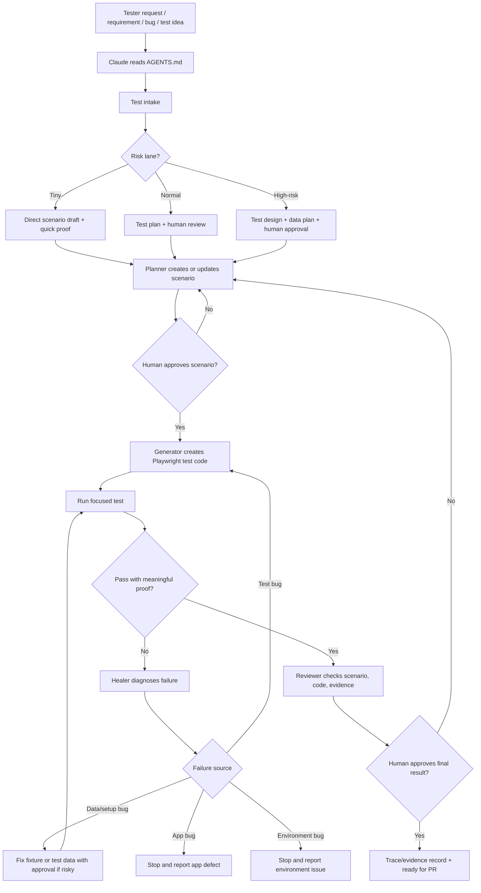
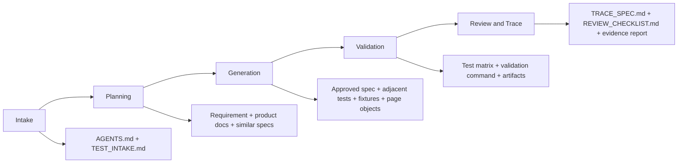
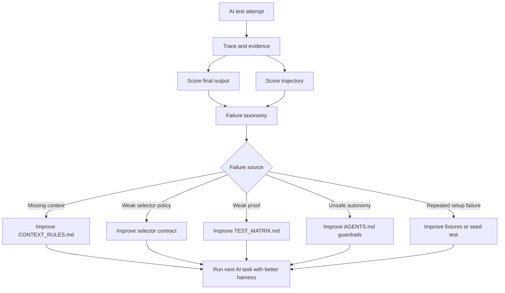

# Automation Test AI Harness Template

Audience: QA engineers, manual testers, automation testers, QA leads, and delivery teams integrating Claude Code into an automation test repository.

Default stack: TypeScript + Playwright Test. The harness pattern can be adapted to Cypress, Selenium, WebdriverIO, Robot Framework, or API automation, but the sample code in this template uses Playwright.

Purpose: turn an automation test repository into an agent-ready workspace where Claude Code can help create test scenarios and test code, while humans remain responsible for supervision, review, approval, and merge decisions.

## 1. What This Harness Is

This template is not just a prompt. It is an operating layer around an automation test repository.

The application under test is what users touch. The test repository is what testers maintain. The harness is what Claude Code touches.

The harness answers these questions before AI writes or changes test code:

- What requirement, user story, bug, or test idea is being automated?
- What test context should Claude Code read first?
- Which live browser tool should Claude Code use for locator discovery?
- Which risk lane applies?
- Which test scenarios must be reviewed by a human before code generation?
- Which selectors, fixtures, page objects, and test data are safe to reuse?
- What proof shows the generated test is correct?
- What trace, evidence, or lesson should future testers and agents inherit?

## 2. Harness Engineering Principles

This template follows the standard harness-engineering model:

- Context engineering: decide what AI reads by phase, not by loading the whole repo.
- Evaluation: judge both final output and the path AI took to produce it.
- Observability: keep traces, command output, screenshots, videos, and reports.
- Orchestration: split work into planner, generator, healer, and reviewer roles.
- Safe autonomy: AI may draft, run, inspect, and propose fixes, but humans approve scenarios and final code.
- Software architecture: test code must follow stable repo patterns, not one-off generated scripts.

Core loop:

```text
human goal
  -> test contract
  -> context builder
  -> Claude Code agent loop
  -> constrained tool execution
  -> observation stream
  -> verifier / human review
  -> trace, evidence, and harness improvement
```

## 3. Control Plane vs Execution Plane

```mermaid
flowchart LR
    subgraph CP[Harness Control Plane]
        A1[AGENTS.md]
        A0[.mcp.json]
        A2[Test intake]
        A3[Context rules]
        A4[Risk lanes]
        A5[Scenario approval gate]
        A6[Test matrix]
        A7[Trace and evidence protocol]
        A8[Review checklist]
    end

    subgraph EP[Execution Plane]
        B1[Automation repo]
        B2[Test plan files]
        B3[Playwright test code]
        B4[Fixtures and page objects]
        B5[Test runner]
        B6[Trace, screenshot, video, report artifacts]
    end

    CP -->|scopes and constrains AI work| EP
    EP -->|returns proof, failures, and artifacts| CP
```



Control plane owns intent, policy, risk, approval gates, context routing, and proof expectations.

Execution plane owns file edits, commands, browser automation, test execution, and artifacts.

## 4. Recommended Repository Surface

Add this surface to an existing automation test repository.

```text
automation-repo/
  AGENTS.md
  CLAUDE.md                         # optional if the team uses Claude Code conventions
  .mcp.json                         # project-scoped Playwright MCP server
  README.md
  docs/
    harness/
      HARNESS.md                    # human + AI collaboration model
      TEST_INTAKE.md                # classify work and choose risk lane
      CONTEXT_RULES.md              # what Claude reads by phase and lane
      TEST_MATRIX.md                # behavior-to-proof matrix
      TRACE_SPEC.md                 # execution evidence and trace requirements
      REVIEW_CHECKLIST.md           # human review checklist for scenario + code
      FAILURE_TAXONOMY.md           # app bug, test bug, data bug, environment bug
    product/                        # product or feature behavior references
    decisions/                      # durable testing or architecture decisions
    templates/
      test-plan.template.md
      evidence-report.template.md
      ai-review.template.md
  prompts/
    planner.prompt.md
    generator.prompt.md
    healer.prompt.md
    reviewer.prompt.md
  specs/
    <feature-name>.test-plan.md
  tests/
    seed.spec.ts
    fixtures/
      app-fixtures.ts
    pages/
      <feature-page>.ts
    <feature-name>/
      <scenario-name>.spec.ts
  reports/
    ai-generated/
      <run-id>.evidence.md
  playwright.config.ts
```

Project-scoped Playwright MCP configuration:

```json
{
  "mcpServers": {
    "playwright": {
      "command": "npx",
      "args": ["@playwright/mcp@latest"]
    }
  }
}
```

Minimum viable surface:

```text
automation-repo/
  AGENTS.md
  .mcp.json
  docs/harness/TEST_INTAKE.md
  docs/harness/CONTEXT_RULES.md
  docs/harness/TEST_MATRIX.md
  docs/harness/TRACE_SPEC.md
  specs/
  tests/
```

## 5. Main Automation Harness Flow



## 6. Claude Code Role Model

Claude Code can play four controlled roles. A human tester decides when to move from one role to the next.

### 6.1 Planner

Planner turns a requirement into a reviewed test scenario. Planner must not write test code.

Inputs:

- User story, acceptance criteria, bug report, or manual testcase.
- Existing product docs or test plans.
- Relevant current test files, fixtures, and page objects.
- Seed test if the app needs login, setup, routing, or state.

Outputs:

- `specs/<feature>.test-plan.md`.
- Scenario list with preconditions, data, steps, expected results, and assertions.
- Risk lane and assumptions.
- Human review questions if requirement is ambiguous.

Stop condition:

- Stop after writing or updating scenario plan.
- Ask human to review before generating code.

### 6.2 Generator

Generator converts an approved test plan into Playwright test code.

Inputs:

- Approved `specs/<feature>.test-plan.md`.
- Existing fixture and page-object patterns.
- Repository naming conventions.
- Test matrix and selector rules.

Outputs:

- Test code under `tests/<feature>/`.
- Page object or fixture updates only if needed.
- Comments that map code blocks to scenario steps when helpful.

Stop condition:

- Run focused validation if commands exist.
- Do not claim completion without execution evidence or a documented blocker.

### 6.3 Healer

Healer runs failing tests, inspects artifacts, and proposes narrow repairs.

Allowed repairs:

- Locator update when UI semantics changed and equivalent element is clear.
- Assertion update only when the approved scenario says the expectation should be different.
- Fixture or test data update when setup is stale.
- Page-object refactor when repeated selector logic is broken.

Forbidden repairs:

- Delete assertions to make the test pass.
- Replace business assertions with weak visibility checks.
- Add `waitForTimeout` as a default fix.
- Skip tests unless there is a documented app bug or unavailable environment.
- Change product behavior from the automation repo.

Failure attribution:

- App bug: product behavior violates requirement.
- Test bug: automation code does not match approved scenario or current UI contract.
- Data/setup bug: account, seed data, environment, or fixture is invalid.
- Environment bug: service unavailable, timeout outside app behavior, browser grid issue.

### 6.4 Reviewer

Reviewer checks the AI output before human approval.

Review dimensions:

- Scenario matches requirement.
- Test code implements scenario steps.
- Assertions prove business behavior.
- Locators are stable and accessible.
- Fixtures and data are reusable.
- Failure handling is honest.
- Evidence is enough for a QA lead to trust the result.

## 7. Risk Lanes

Risk lanes decide how much context, review, and proof are required.

### Tiny

Use for:

- Rename test title.
- Fix typo in test plan.
- Update non-behavioral docs.
- Narrow selector replacement with unchanged behavior.

Required proof:

- Focused test run if code changed.
- Short evidence note.

### Normal

Use for:

- Add a new test scenario for one feature.
- Convert one manual testcase to automation.
- Update fixture or page object for one flow.
- Repair flaky test with clear root cause.

Required proof:

- Human-approved scenario before code.
- Focused test command.
- Evidence report with command output and artifact paths.

### High-risk

Use for:

- Authentication, authorization, payment, order creation, user data, financial data.
- Cross-browser or cross-platform test coverage changes.
- Shared fixture, global setup, CI config, or test data lifecycle changes.
- Broad refactor of page objects or test architecture.
- Weak or unavailable proof.

Required proof:

- Test design review before code.
- Data setup plan.
- Focused test run plus affected smoke/regression subset.
- Explicit QA lead approval.
- Trace record with failure taxonomy if any failure occurred.

## 8. Context Rules

Claude Code should load context by phase and lane.



Tiny lane target: read only entrypoint, relevant test file, and validation command.

Normal lane target: read entrypoint, intake, approved spec, adjacent tests, fixtures, and page objects.

High-risk lane target: read entrypoint, intake, product docs, architecture decisions, test matrix, global setup, fixture contracts, CI notes, and prior evidence if available.

Rule: do not maximize context. Load the smallest context that can safely solve the current phase.

## 9. Test Intake Contract

Every AI-assisted automation request should be restated as a test work item before scenario or code generation.

Template:

```md
# Test Intake

## Source
- Requester:
- Date:
- Source type: user story | bug | manual testcase | exploratory note | regression gap
- Link or reference:

## Restated Work Item
- Feature:
- Behavior to verify:
- Out of scope:

## Risk Lane
- Lane: Tiny | Normal | High-risk
- Risk flags:
- Human approval required before code: Yes | No

## Context To Read
- Product docs:
- Existing specs:
- Existing tests:
- Fixtures/page objects:

## Done Proof
- Scenario plan path:
- Test code path:
- Validation command:
- Required artifacts:
```

## 10. Test Plan Contract

Generated scenario plans must be precise enough for a tester to review and for AI to generate code.

Template:

```md
# <Feature> Test Plan

## Requirement
<Original or restated requirement>

## Assumptions
- <Assumption 1>

## Test Data
- Account:
- Environment:
- Seed state:

## Scenarios

### TC-001: <Scenario name>

Risk lane: Tiny | Normal | High-risk

Priority: P0 | P1 | P2
Type: smoke | regression | integration | negative | accessibility

Preconditions:
- <Precondition>

Steps:
1. <Action>
2. <Action>

Expected results:
- <Business outcome>
- <UI/API state>
- <Data state if applicable>

Locator strategy:
- Prefer role/label/text locators.
- Avoid brittle CSS/XPath unless no semantic locator exists.

Assertions:
- <Meaningful assertion>

Human review status: Draft | Approved | Needs changes
Reviewer:
Review notes:
```

## 11. Test Matrix Contract

The test matrix maps behavior to proof. This prevents AI from writing tests that pass without validating useful behavior.

```md
# Test Matrix

| Behavior | Test level | Required proof | Command | Artifact | Owner |
| --- | --- | --- | --- | --- | --- |
| Login succeeds with valid credentials | E2E smoke | User lands on dashboard and session UI is visible | `npx playwright test tests/auth/login-valid.spec.ts --trace=on` | HTML report + trace | QA |
| Login rejects invalid password | E2E regression | Error message visible and user remains unauthenticated | `npx playwright test tests/auth/login-invalid.spec.ts --trace=on` | HTML report + trace | QA |
```

## 12. Selector And Assertion Policy

Preferred locator order:

1. `page.getByRole()` with accessible name.
2. `page.getByLabel()` for form controls.
3. `page.getByPlaceholder()` when label is unavailable.
4. `page.getByText()` for stable user-visible text.
5. `page.getByTestId()` if the product has a stable test id contract.
6. CSS or XPath only when semantic locators are not available and the reason is documented.

Assertion rules:

- Assert business outcome, not only UI existence.
- Prefer web-first Playwright assertions such as `toBeVisible`, `toHaveURL`, `toHaveText`, `toBeEnabled`, and `toHaveValue`.
- Avoid sleeps. Use Playwright auto-waiting and assertions.
- Do not weaken assertions to make tests pass.
- Negative tests must assert both the error and the absence of the forbidden success state.

## 13. Trace And Evidence Contract

Every AI-generated or AI-modified testcase should produce an evidence report.

Template:

```md
# AI Test Evidence Report

## Summary
- Feature:
- Scenario:
- Risk lane:
- Result: Pass | Fail | Blocked
- Date:
- AI role used: planner | generator | healer | reviewer

## Files Created Or Updated
- `specs/...`
- `tests/...`

## Validation
- Command:
- Exit code:
- Result summary:

## Artifacts
- HTML report:
- Trace:
- Screenshot:
- Video:

## Failure Attribution
- Classification: none | app bug | test bug | data/setup bug | environment bug
- Root cause:
- Action taken:
- Stop condition reached:

## Human Review
- Scenario reviewed by:
- Code reviewed by:
- Decision: Approved | Needs changes | Blocked
- Notes:
```

## 14. Root `AGENTS.md` Template

Copy this into the target automation repo and adjust project-specific commands.

```md
# Agent Instructions

This repository contains automation tests. Claude Code may help draft test scenarios, generate test code, run focused validation, inspect artifacts, and prepare evidence. Humans approve scenarios, code, and merge decisions.

## Harness Entry Points

Before test work, read:

- `docs/harness/HARNESS.md`
- `docs/harness/TEST_INTAKE.md`
- `docs/harness/CONTEXT_RULES.md`
- `docs/harness/TEST_MATRIX.md`
- `docs/harness/TRACE_SPEC.md`
- `docs/harness/REVIEW_CHECKLIST.md`

## Workflow Rules

- Restate every request as a test work item first.
- Create or update a test plan in `specs/` before writing test code.
- Do not generate test code until the scenario is approved by a human, unless the request is a Tiny lane docs-only or selector-only task.
- Follow existing fixtures, page objects, naming, and folder structure.
- Prefer semantic Playwright locators: role, label, placeholder, text, then test id.
- Do not use `waitForTimeout` as a default fix.
- Do not delete or weaken assertions to make a test pass.
- Classify failures as app bug, test bug, data/setup bug, or environment bug.
- Write an evidence report in `reports/ai-generated/` after AI-generated or AI-modified tests.

## Validation Commands

- Install dependencies: `<project command>`
- Run focused test: `<project command>`
- Open report: `<project command>`

## Feature Tracking

- Current AI-assisted test work:
  - Feature: TBD
  - Scenario plan: TBD
  - Test code: TBD
  - Status: not verified
  - Evidence: none yet

## Definition Of Done

A test task is done only when:

- Scenario plan exists and is human-approved.
- Test code follows repo patterns.
- Validation command was run or blocker is documented.
- Evidence report exists.
- Final response states changed files, proof, and limits.
```

## 15. Prompt Templates

### Planner Prompt

```md
You are the automation test planner.

Goal: create or update a human-reviewable test plan. Do not write test code.

Inputs:
- Requirement or testcase from the tester.
- Relevant product docs.
- Existing specs and similar tests.
- Seed test if needed.

Tasks:
1. Restate the behavior under test.
2. Classify risk lane.
3. Identify assumptions and missing information.
4. Create scenarios with preconditions, steps, expected results, test data, assertions, and locator strategy.
5. Mark human review status as Draft.

Stop after writing the plan. Ask for human approval before code generation.
```

### Generator Prompt

```md
You are the automation test generator.

Goal: convert an approved test plan into Playwright test code.

Inputs:
- Approved `specs/<feature>.test-plan.md`.
- Existing fixtures and page objects.
- Adjacent tests in the same feature area.

Tasks:
1. Follow existing project style.
2. Use semantic locators.
3. Write meaningful business assertions.
4. Run the focused validation command if available.
5. Create an evidence report with command output and artifacts.

Do not weaken assertions or skip tests to make the run pass.
```

### Healer Prompt

```md
You are the automation test healer.

Goal: diagnose and repair failing AI-generated or AI-modified tests safely.

Tasks:
1. Reproduce the failure with the narrowest command.
2. Inspect error output, trace, screenshot, video, and current UI if available.
3. Classify failure: app bug, test bug, data/setup bug, environment bug.
4. Apply only narrow repairs when the failure is a test or setup issue.
5. Stop and report when the failure is an app or environment issue.
6. Update evidence report.

Forbidden:
- Removing assertions to pass.
- Adding arbitrary sleeps.
- Skipping tests without documented blocker.
```

### Reviewer Prompt

```md
You are the automation test reviewer.

Goal: review AI-generated test plan, test code, and evidence.

Check:
- Requirement coverage.
- Scenario clarity.
- Preconditions and test data.
- Stable locator strategy.
- Meaningful assertions.
- Failure honesty.
- Evidence completeness.

Return findings first, ordered by severity. If no findings exist, say that explicitly and list residual risks.
```

## 16. Human Review Checklist

Use this checklist before approving AI-generated test scenarios and code.

Scenario review:

- Requirement is restated correctly.
- Scope is clear.
- Preconditions are realistic.
- Steps match real user behavior.
- Expected results prove business value.
- Negative paths are included when relevant.
- Test data is safe and maintainable.

Code review:

- Test name is readable and maps to scenario ID.
- Test uses existing fixtures and page objects.
- Locators are semantic and stable.
- Assertions verify outcomes, not implementation details.
- No arbitrary sleep.
- No skipped test without documented blocker.
- Test can run independently or states its dependency clearly.

Evidence review:

- Command is recorded.
- Result is recorded.
- Artifacts are linked when available.
- Failures are classified honestly.
- Human decision is recorded.

## 17. Sample: Create A Testcase With The Harness

This sample shows how a tester works with Claude Code using the harness.

### 17.1 Tester Request

```text
Create an automation testcase for login with valid credentials.

Requirement:
As a registered user, I can log in with a valid email and password so that I can access my dashboard.

Acceptance criteria:
- User can enter email and password.
- User can submit the login form.
- After successful login, user is redirected to dashboard.
- Dashboard shows the user's display name.
- Login error message is not shown.
```

### 17.2 Intake Output

```md
# Test Intake

## Source
- Requester: QA tester
- Date: 2026-05-31
- Source type: user story
- Link or reference: inline request

## Restated Work Item
- Feature: Authentication
- Behavior to verify: Registered user can log in with valid credentials and access dashboard.
- Out of scope: invalid password, locked account, password reset, MFA.

## Risk Lane
- Lane: High-risk
- Risk flags: authentication, session state, user data, cross-page redirect
- Human approval required before code: Yes

## Context To Read
- Product docs: `docs/product/authentication.md` if present
- Existing specs: `specs/auth*.md` if present
- Existing tests: `tests/auth/`, `tests/fixtures/`, `tests/pages/`
- Fixtures/page objects: login fixture, auth storage state, dashboard page

## Done Proof
- Scenario plan path: `specs/auth-login.test-plan.md`
- Test code path: `tests/auth/login-valid.spec.ts`
- Validation command: `npx playwright test tests/auth/login-valid.spec.ts --trace=on`
- Required artifacts: command output, trace, HTML report path
```

### 17.3 AI-Generated Test Plan

File: `specs/auth-login.test-plan.md`

```md
# Authentication Login Test Plan

## Requirement
As a registered user, I can log in with a valid email and password so that I can access my dashboard.

## Assumptions
- The test environment has a registered active user.
- Credentials are provided through environment variables or a secure test-data fixture.
- The dashboard route is `/dashboard`.
- The dashboard exposes the user's display name in accessible text.

## Test Data
- Email: `process.env.E2E_USER_EMAIL`
- Password: `process.env.E2E_USER_PASSWORD`
- Display name: `process.env.E2E_USER_DISPLAY_NAME`
- Environment: configured by Playwright `baseURL`

## Scenarios

### TC-AUTH-001: Login succeeds with valid credentials

Risk lane: High-risk
Priority: P0
Type: smoke, regression

Preconditions:
- Test user exists and is active.
- User is logged out before test starts.
- Login page is reachable.

Steps:
1. Navigate to the login page.
2. Fill the email field with a valid registered email.
3. Fill the password field with the matching valid password.
4. Submit the login form.

Expected results:
- User is redirected to `/dashboard`.
- Dashboard page is visible.
- User display name is visible on the dashboard.
- Login error message is not visible.

Locator strategy:
- Use `getByLabel` for email and password fields.
- Use `getByRole('button', { name: /sign in|log in/i })` for submit.
- Use URL assertion for dashboard redirect.
- Use visible display name or dashboard heading for success.

Assertions:
- URL contains `/dashboard`.
- Dashboard heading or landmark is visible.
- Display name is visible.
- Login error alert is hidden or absent.

Human review status: Draft
Reviewer:
Review notes:
```

Human approval step:

```text
QA reviews `specs/auth-login.test-plan.md`.
If correct, QA changes `Human review status: Approved` or tells Claude Code: "Approved, generate the test code."
```

### 17.4 Sample Playwright Page Object

File: `tests/pages/login-page.ts`

```ts
import { expect, type Page } from '@playwright/test';

export class LoginPage {
  constructor(private readonly page: Page) {}

  async goto() {
    await this.page.goto('/login');
  }

  async login(email: string, password: string) {
    await this.page.getByLabel(/email/i).fill(email);
    await this.page.getByLabel(/password/i).fill(password);
    await this.page.getByRole('button', { name: /sign in|log in/i }).click();
  }

  async expectNoLoginError() {
    await expect(this.page.getByRole('alert')).toBeHidden();
  }
}
```

### 17.5 Sample Generated Test Code

File: `tests/auth/login-valid.spec.ts`

```ts
// spec: specs/auth-login.test-plan.md
// scenario: TC-AUTH-001

import { expect, test } from '@playwright/test';
import { LoginPage } from '../pages/login-page';

test.describe('Authentication login', () => {
  test('TC-AUTH-001: login succeeds with valid credentials', async ({ page }) => {
    const email = process.env.E2E_USER_EMAIL;
    const password = process.env.E2E_USER_PASSWORD;
    const displayName = process.env.E2E_USER_DISPLAY_NAME;

    expect(email, 'E2E_USER_EMAIL must be configured').toBeTruthy();
    expect(password, 'E2E_USER_PASSWORD must be configured').toBeTruthy();
    expect(displayName, 'E2E_USER_DISPLAY_NAME must be configured').toBeTruthy();

    const loginPage = new LoginPage(page);

    await loginPage.goto();
    await loginPage.login(email!, password!);

    await expect(page).toHaveURL(/\/dashboard/);
    await expect(page.getByRole('heading', { name: /dashboard/i })).toBeVisible();
    await expect(page.getByText(displayName!)).toBeVisible();
    await loginPage.expectNoLoginError();
  });
});
```

Notes for teams:

- If the app uses `data-testid`, configure `testIdAttribute` in Playwright and document the contract.
- If login is expensive, keep this as a smoke test and use storage-state setup for other authenticated tests.
- If the dashboard heading is different, update the approved test plan before changing the assertion.

### 17.6 Sample Evidence Report

File: `reports/ai-generated/2026-05-31-auth-login-valid.evidence.md`

```md
# AI Test Evidence Report

## Summary
- Feature: Authentication
- Scenario: TC-AUTH-001 login succeeds with valid credentials
- Risk lane: High-risk
- Result: Pass
- Date: 2026-05-31
- AI role used: generator, healer, reviewer

## Files Created Or Updated
- `specs/auth-login.test-plan.md`
- `tests/pages/login-page.ts`
- `tests/auth/login-valid.spec.ts`

## Validation
- Command: `npx playwright test tests/auth/login-valid.spec.ts --trace=on`
- Exit code: 0
- Result summary: 1 test passed

## Artifacts
- HTML report: `playwright-report/index.html`
- Trace: `test-results/auth-login-valid/trace.zip`
- Screenshot: none captured because test passed
- Video: none configured

## Failure Attribution
- Classification: none
- Root cause: none
- Action taken: none
- Stop condition reached: passing focused test with trace enabled

## Human Review
- Scenario reviewed by: <QA reviewer>
- Code reviewed by: <QA reviewer>
- Decision: Approved
- Notes: Test validates redirect, dashboard visibility, display name, and absence of login error.
```

## 18. Failure Recovery Examples

### Locator Failure

Symptom:

```text
getByLabel(/email/i) resolved to 0 elements
```

Allowed recovery:

- Inspect page accessibility tree or trace.
- If field is labeled `Username or email`, update locator to `getByLabel(/username or email|email/i)`.
- Record reason in evidence.

Stop condition:

- If field has no accessible label, report product accessibility gap or use a documented test id if available.

### Dashboard Assertion Failure

Symptom:

```text
Expected URL /dashboard but URL is /account
```

Allowed recovery:

- Check approved requirement and current product docs.
- If docs say dashboard route changed to `/account`, update test plan first and request human approval.
- If requirement still says `/dashboard`, report app bug.

Forbidden recovery:

- Replace URL assertion with a generic visibility assertion without approval.

### Environment Failure

Symptom:

```text
net::ERR_CONNECTION_REFUSED
```

Allowed recovery:

- Check whether local server command is documented.
- Run documented setup command only if safe.
- If unavailable, stop and report environment blocker.

## 19. Harness Reliability Loop

Use every AI-assisted testcase to improve the harness.



Score final output:

- Did the generated scenario match the requirement?
- Did test code implement the approved scenario?
- Did the focused test pass or fail honestly?
- Was evidence enough for human review?

Score trajectory:

- Did Claude Code read the right context?
- Did it ask before crossing approval gates?
- Did it classify failures correctly?
- Did it avoid unsafe shortcuts?
- Did it record useful evidence?

## 20. Adoption Guide

Recommended rollout:

1. Add `AGENTS.md` and `docs/harness/` to one pilot automation repo.
2. Pick one low-risk feature and one high-risk feature.
3. Ask testers to use Planner only for the first week.
4. Enable Generator after scenario-review habits are stable.
5. Enable Healer only with failure taxonomy and evidence reports.
6. Review traces weekly and improve context rules, test matrix, and guardrails.
7. Convert repeated successful patterns into reusable prompts, fixtures, and page objects.

Team operating rule:

```text
AI drafts. Tester reviews. Evidence proves. Human approves.
```

## 21. Definition Of Done

An AI-assisted automation testcase is done only when:

- Test intake exists or is summarized in the evidence report.
- Test plan exists and is human-approved.
- Test code follows repo conventions.
- Test uses stable locators and meaningful assertions.
- Focused validation command was run, or blocker is documented.
- Trace/evidence report exists.
- Failure attribution is documented if any failure occurred.
- Human final decision is recorded.

## 22. What Not To Do

- Do not ask AI to write automation code directly from a vague request.
- Do not skip the test-plan review gate for normal or high-risk scenarios.
- Do not let AI silently change expected behavior.
- Do not accept a passing test without checking assertion quality.
- Do not let generated tests create irreversible data unless explicitly approved.
- Do not treat trace artifacts as optional for high-risk flows.
- Do not use this harness as a replacement for QA ownership.

## 23. Template Summary

This harness standardizes how testers work with Claude Code:

```text
tester request
  -> intake and risk lane
  -> context routing
  -> AI-generated scenario plan
  -> human scenario review
  -> AI-generated Playwright code
  -> focused execution
  -> failure attribution and safe repair
  -> evidence report
  -> human final approval
  -> improved next run
```

The goal is not full autonomy. The goal is controlled acceleration: AI handles drafting, execution, diagnosis, and trace capture; humans retain judgment, product understanding, and final accountability.
